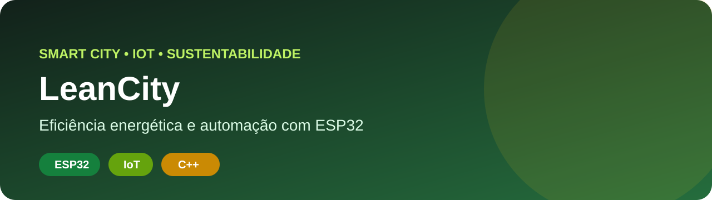
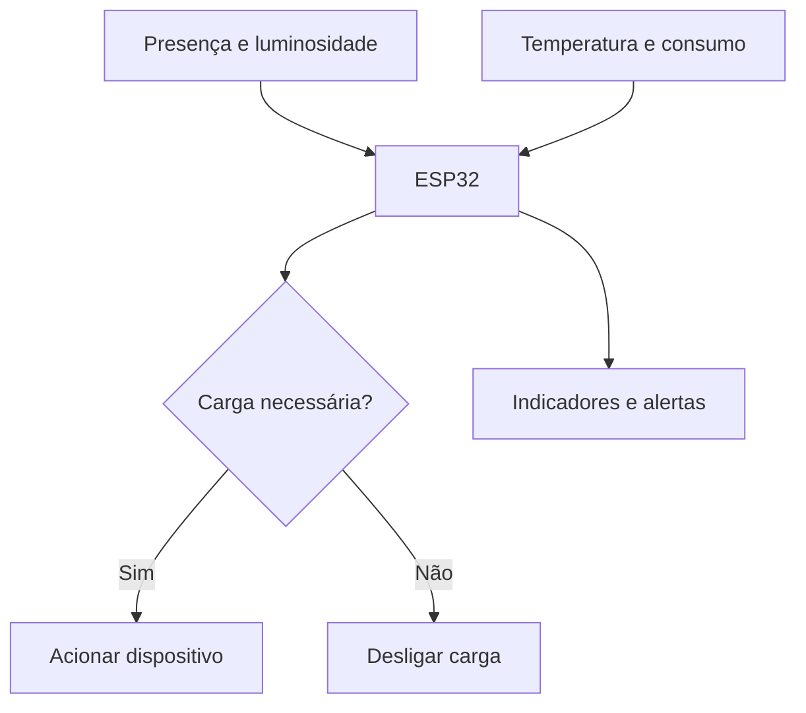
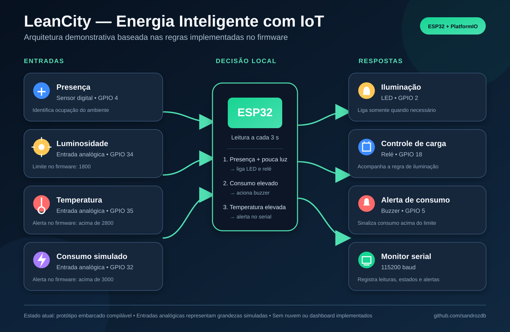

<p align="center"></p>

# LeanCity — Eficiência Energética com IoT

Protótipo de cidade inteligente que utiliza sensores e automação para identificar desperdícios, controlar cargas e apoiar decisões sobre consumo de energia.

## Problema

Luzes e equipamentos frequentemente permanecem ligados sem necessidade em salas, prédios e espaços públicos. Isso aumenta custos operacionais e impacto ambiental, mas nem sempre existem dados para identificar onde agir primeiro.

## Solução

O ESP32 interpreta presença, luminosidade, temperatura e consumo simulado para decidir quando acionar cargas e alertas.



## Arquitetura demonstrativa



O visual representa o que já está implementado no firmware: quatro entradas, processamento local no ESP32 e respostas por LED, relé, buzzer e monitor serial. As leituras analógicas são simuladas e o projeto ainda não possui nuvem ou dashboard conectado.

## Regras demonstradas

- desligar iluminação sem presença;
- aproveitar luminosidade natural;
- acompanhar temperatura do ambiente;
- sinalizar consumo acima do limite;
- registrar estados para análise posterior.

## Diferenciais

- problema diretamente ligado a custo e sustentabilidade;
- lógica embarcada clara e reproduzível;
- arquitetura preparada para nuvem e dashboards;
- compilação automática com PlatformIO;
- indicadores definidos sem inventar resultados.

## Indicadores para um piloto

| Indicador | Decisão apoiada |
|---|---|
| Consumo antes e depois | Estimar economia |
| Tempo ligado sem presença | Identificar desperdício |
| Alertas de consumo | Localizar ocorrências |
| Disponibilidade do sistema | Medir confiabilidade |
| Consumo médio por ambiente | Priorizar intervenções |

## Como executar

1. Instale o VS Code e a extensão PlatformIO.
2. Abra o projeto.
3. Conecte uma placa ESP32 ou use um ambiente de simulação.
4. Compile e envie o firmware.
5. Abra o monitor serial em `115200`.

```bash
pio run
pio run --target upload
pio device monitor
```

## Estrutura

```text
├── src/main.cpp          # regras e leitura dos sensores
├── platformio.ini        # ambiente de compilação
├── assets/cover.svg
├── assets/arquitetura-demonstrativa.svg
├── .github/workflows/    # validação automática
└── README.md
```

## Aplicações possíveis

- prédios e salas inteligentes;
- escolas e universidades;
- iluminação pública;
- laboratórios;
- automação predial;
- projetos de sustentabilidade.

## Qualidade

O GitHub Actions compila o firmware em cada PR e atualização da `main`, ajudando a impedir a publicação de código quebrado.

## Próximos passos

- montar o circuito em um simulador e registrar sua execução;
- conectar o protótipo a uma plataforma em nuvem;
- coletar dados reais de consumo;
- criar dashboard de indicadores;
- expandir para múltiplos ambientes;
- avaliar previsão de consumo com IA.

## Autor

**Sandro Ferreira** — estudante de Engenharia da Computação e de Inteligência Artificial e Automação Digital.

[LinkedIn](https://linkedin.com/in/sandrozdb) · [GitHub](https://github.com/sandrozdb)
